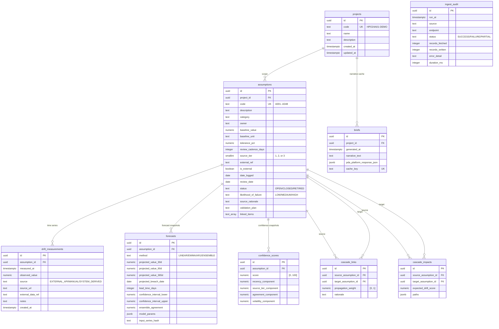

# Project Trueplan: Database Schema

All tables live under the `evidence_engine` schema. Authoritative reference: [`ARCHITECTURE.md`](../../ARCHITECTURE.md) section 4.

## Entity relationship diagram

## Tables

### `projects`

One row per project or programme. The `code` is a stable human-readable identifier (uppercase alphanumeric plus hyphen, 3-32 chars). All downstream tables are scoped to a `project_id`.

Current rows:

| code            | name                                |
| --------------- | ----------------------------------- |
| `HPO24A01-DEMO` | HPO24A01 Holographic Project Office |

### `assumptions`

One row per stated assumption. Each row carries:

- **Identity:** `code` unique within a project, free-text `description` and `category`.
- **Anchoring:** `is_external` is true if the assumption depends on something outside the project's control; `source_tier` is 1 for official statistics (ONS, BoE, gov.uk), 2 for reputable secondary sources, 3 for internal estimates; `external_ref` is the opaque key the ingestion layer uses to look up the upstream series.
- **Tolerance:** `baseline_value`, `baseline_unit`, `tolerance_pct`. Drift score is computed relative to these; see ARCHITECTURE.md section 3.3.
- **Review:** `review_cadence_days`, `review_date`, `status`.
- **Register metadata:** `owner`, `likelihood_of_failure`, `impact_if_false`, `source_rationale`, `validation_plan`, `linked_items`.
- **PDA Platform integration:** `pda_platform_id` lets the narrative generator tie back to an external record.

Constraints: `code` matches `^A\d{3,4}$`. `unique (project_id, code)`. `status` in `{OPEN, CLOSED, RETIRED}`. `likelihood_of_failure` in `{LOW, MEDIUM, HIGH}`. `source_tier` in `{1, 2, 3}`.

Indexes: `project_id`, `category`, `is_external`.

### `drift_measurements`

Append-only time series. The only way rows enter is via INSERT by the service role or by the `authenticated` role (for future client-side writes); UPDATE and DELETE are revoked in migration 0004.

- `source` in `{EXTERNAL_API, MANUAL, SYSTEM_DERIVED}` identifies provenance.
- `source_url` and `external_data_ref` let an audit trace find the upstream record.
- `notes` is free text. We use it to flag synthetic data and to document stub history.

Indexes: `(assumption_id, measured_at desc)` for latest-first lookup, and `source`.

### `cascade_links`

Directed edges in the cascade DAG. Weight is in `[0, 1]` (0 = no transmission, 1 = linear pass-through). Self-loops are rejected by check constraint. The `(source, target)` pair is unique. The `rationale` column is **not nullable** because a cascade link without a defensible rationale is unusable in a paper appendix.

### `forecasts`

One forecast snapshot per `(assumption_id, computed_at)`. Columns carry the 30-, 90-, and 365-day projections, confidence interval, ensemble agreement, projected breach date, and lead time in days. `input_series_hash` is a SHA-256 of the sorted measurement series, used so we can detect when a re-forecast is needed without rehashing the whole table.

### `cascade_impacts`

Materialised downstream drift per `(source, target)` pair. `paths` is a JSON array of `{nodes: [...], weight}` records, one per distinct path through the cascade DAG. `expected_drift_score` aggregates with a saturation cap at 1.

### `confidence_scores`

Confidence in `[0, 100]` with four components:

- `recency_component`: time since last review, decayed against the assumption's review cadence.
- `source_tier_component`: 1, 2, or 3 mapped to a multiplier.
- `agreement_component`: variance between multiple external signals anchored to the same concept.
- `volatility_component`: standard deviation of the recent measurement series.

Methodology and weights land in `packages/intelligence/METHODOLOGY.md` in Prompt 6.

### `briefs`

Cached narrative briefs generated by PDA Platform. `cache_key` is a deterministic hash of the inputs (project state summary). Repeat calls return the cached row.

### `ingest_audit`

One row per external-data ingestion run. Supports the paper reproducibility claim; also used for demo-reliability retrospectives.

## Current row counts (as of PR)

| Table                | Rows         |
| -------------------- | ------------ |
| `projects`           | 1            |
| `assumptions`        | 47           |
| `cascade_links`      | 19           |
| `drift_measurements` | 423          |
| `forecasts`          | 0 (Prompt 4) |
| `cascade_impacts`    | 0 (Prompt 5) |
| `confidence_scores`  | 0 (Prompt 6) |
| `briefs`             | 0 (Prompt 9) |
| `ingest_audit`       | 0 (Prompt 3) |

## Notes on deviations from the Prompt 1 spec

The spec named the three externally-anchored assumptions as A039 Inflation, A040 Interest Rates, A041 Tax Policy. The actual HPO register ships them as **A046, A047, A048** with the same semantic meaning. The register codes also skip A037 (jumps A036 -> A038), giving 47 codes in total. The `assumptions_code_format` check constraint tolerates three- or four-digit codes; the seed data happens to use three-digit codes throughout.
